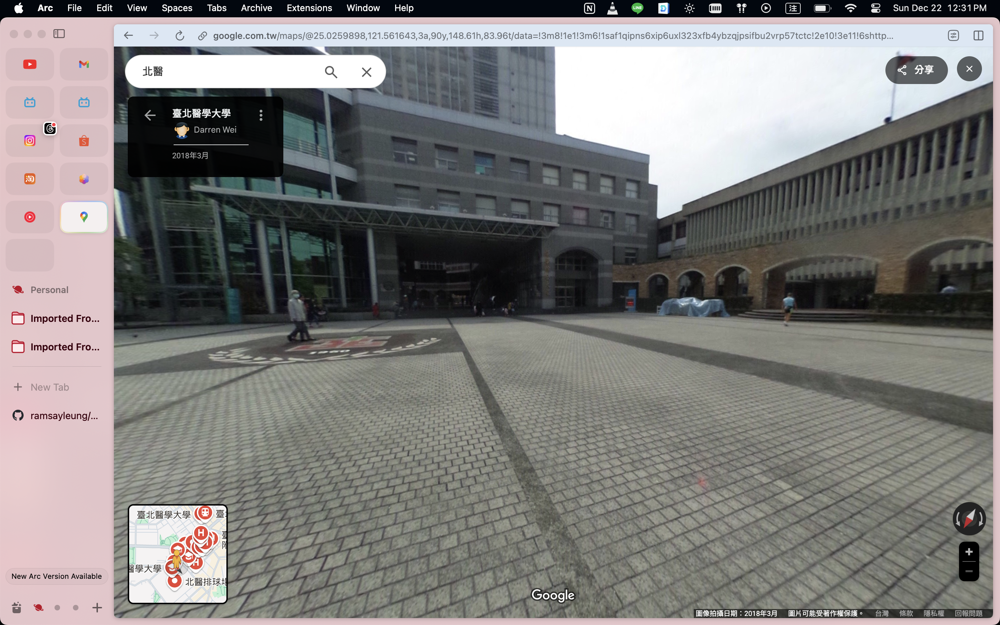

今天是星期日，中午在學校附近吃飽就往圖書館移動。

在校園內看到小孩們在跑跑跳跳玩耍，雖然這也不是第一次在假日看到。天氣好的時候，假日的中原總是充滿著帶著小孩的爸爸媽媽們。

小時候家裡住在台北醫學大學附近，只要我父親在台灣，他就常常帶我去北醫裡面玩（帶我去放電xd），打籃球、足球、棒球、跑步，和父親的回憶充滿在北醫裡面，這些記憶仍然歷歷在目。

 

但你要問我，最有印象的事情是什麼？

我會不假思索的回答：**學會騎腳踏車** 

我還記得我在北醫的大門廣場學會騎腳踏車的。

估計我父親都忘記了吧xd。當初我父親幫我把輔助輪拆掉，然後幫我推了幾次腳踏車之後，很神奇的用力踩，就開始往前了！

現在回想起來，就像考到汽車駕照的感覺一樣。
