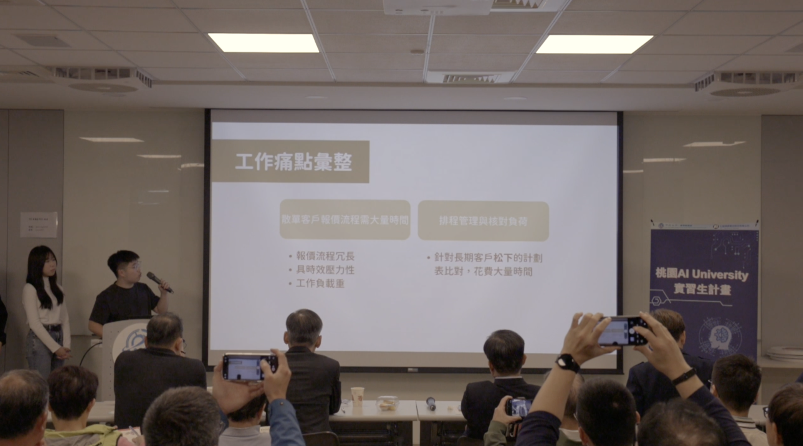
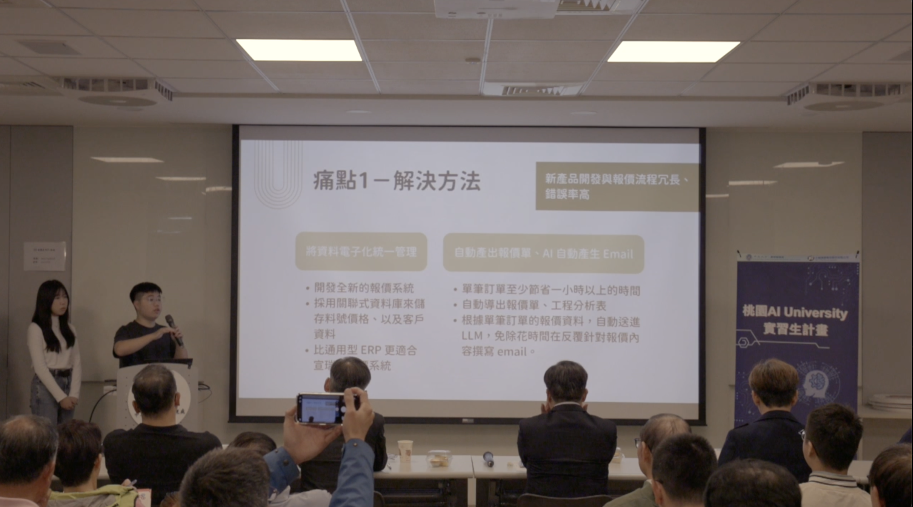
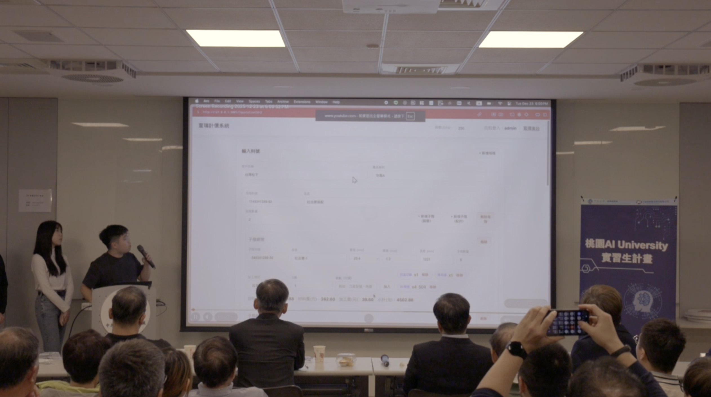

In the second half of 2025, I participated in the Taoyuan AI University program, an experience that gave me a profound understanding of the critical importance of AI and digitalization in traditional industries.

My team and I had the privilege of partnering with Hsuan Jui Co., Ltd. (宣瑞股份有限公司) to spearhead their digital transformation. During this period, I focused on developing and implementing a Digital Quotation System enhanced with AI assistance. This solution successfully saved the company over one hour of processing time per order quotation, drastically improving operational efficiency and allowing the team to focus on high-value tasks.

As we move into 2026, the rise of Large Language Models (LLMs) and AI Agents is no longer just a trend; it is a fundamental shift in how business is conducted.

For Taiwan’s traditional industries, the challenge is clear: it is no longer about whether to adopt AI, but how to strategically leverage AI to stay competitive. Integrating AI Agents into legacy workflows isn't just about saving time and costs—it’s about enabling enterprises to focus on higher-value initiatives and innovation.

I am proud to have contributed to the smart upgrade of our local enterprises and am excited to see how AI-human collaboration will continue to reshape our industries this year! I will continue to help traditional industries adopt AI, empowering them to connect with the global market and stay ahead in the world stage.

