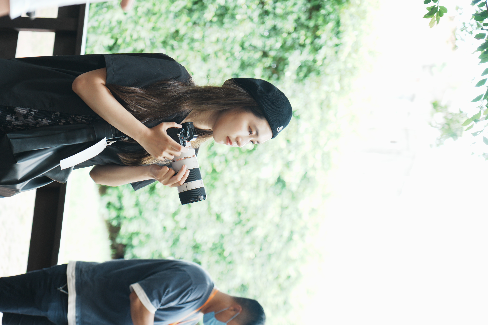
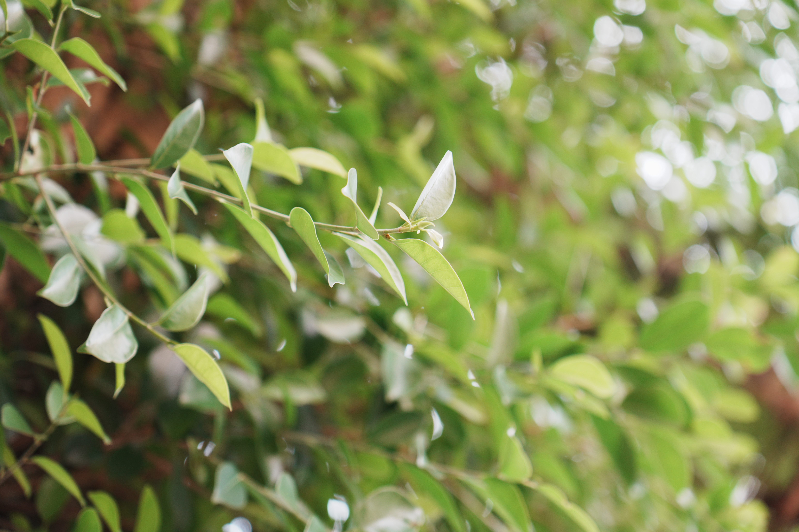
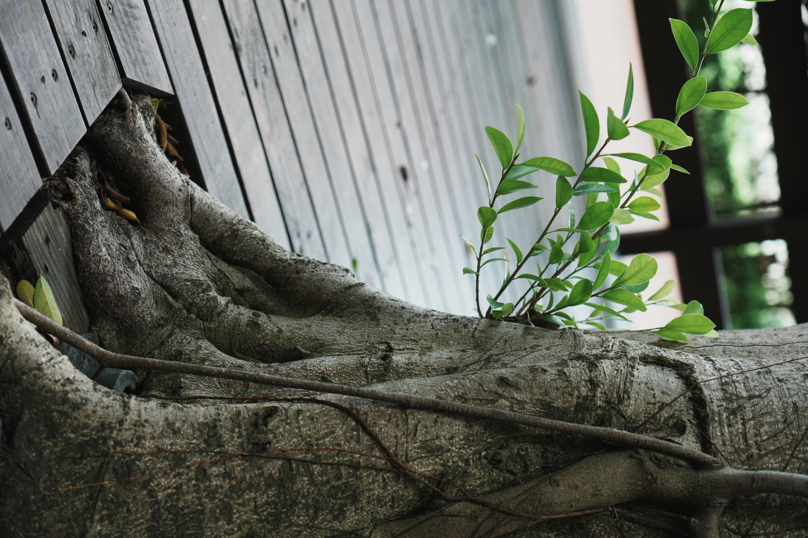

近期 Jabee 在我的 Notion 中找到一篇文，是一篇當年 A6700 尚未上市的時候，有幸受 Sony 邀請參與上市前體驗會。老實說 A6700 有多好用現在我真的是忘記了，我只記得 Sony 送了小禮物然後現場很多吃的xddd。倒是對於現場的擺出了一些微距造景之類的給大家試拍，還鼓勵大家拿到室外隨便拍，用到讓我對這台小機子出現心動了。但還是那句老話，底大一級壓死人，全幅機也是看起來專業許多，所以也不曾考慮 A6 系列。

然後 Sony 官方也請大家寫寫心得發在 Facebook 上，抽幾台 A6700 給大家（具體抽了幾台我也忘了，畢竟受邀參加的人也不多）， 因此有了以下這篇文，文後也附上幾張當天拍的照片。此外，當年因為是未上市機型，因此進 Lr 解不了 RAW 所以這些照片我也都沒修過，都是 JPG。

# 正文

永遠還記得第一次開始攝影只是出於好奇心，把父親幾年前放在倉庫長灰塵的 Sony Nex-5n 拿出來玩看看，卻玩的一竅不通（26年的我看到這邊突然想到其實我在更早就開始玩相機了，但我就單純當望遠鏡在用），開始詢問身邊在攝影的朋友。

慢慢的，我開始對攝影產生了很大的興趣，只要有出去玩一定都帶著我的5n。上山下海的出遊、父母婚禮的紀錄，甚至到後來出門都一定帶著它，因為我不想錯過我身邊各種美好的瞬間，想要記錄下一切。

但玩了半年多就發現，5n的各種性能、拍照的速度實在太慢。在聽了各種網路上的攝影師洗腦畫幅越大越好的洗腦後，開了有了購買全畫幅的機種，在評比各家原廠副廠鏡頭的數量後，我發現Sony在這方面可以說是非常大的領先其他廠牌，尤其是Apsc和全畫幅的鏡頭通用，我並不需要捨棄原本已購買的鏡頭，因此我果斷入手了人生第一台自己買的相機 Sony A7。

在購買這台相機後，確實拍照的速度增加了，晚上終於能拍照了。但我開始發現我不會每天出門都帶著A7，因為上面的觀景窗總是突出一塊不容易放進包包，最近和朋友出遊去澎湖，也苦於只帶一個後背包，因此沒把A7帶上，錯果了很多我想拍的風景，開始有了更換A6系列的想法。

這次參加了社團舉辦的a6700體驗，讓我非常意外，我試著在小光圈下提高iso，噪點的表現讓我非常意外之好，在色彩表現和對焦速度上讓我嘆為觀止，遠遠超越我的A7。尤其小巧的機身，也不會讓我有帶不出門的擔憂。

# 照片

