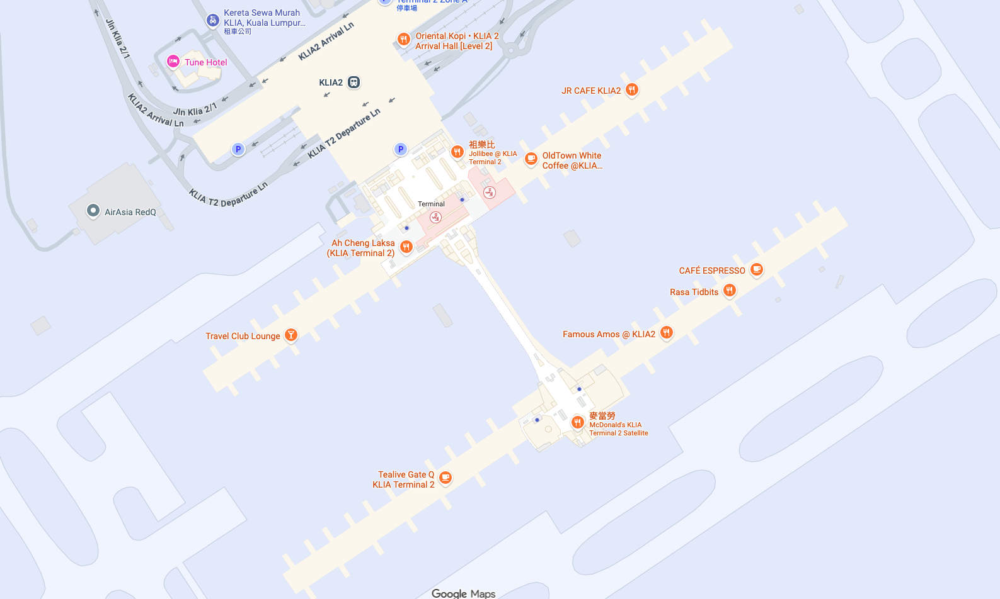
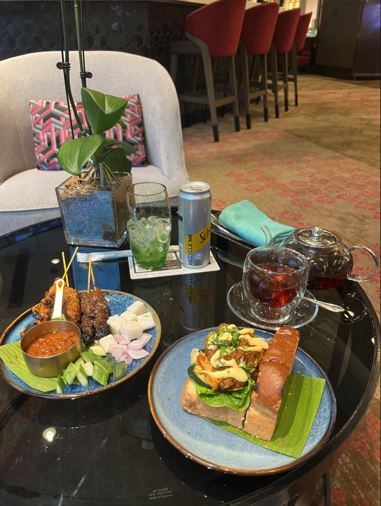

目前 Jabee 正在四萬英尺的高空上，由亞洲航空執飛的吉隆坡國際機場飛往關西國際機場 D7 378 的班機上，如果大家有看到這篇文章的話，那就代表 Jabee 成功安全落地今年第 10 趟的飛行（畢竟亞航沒網路給我用 xdddd）。

過去爬了不少攻略都表明吉隆坡機場很大，出境時間建議抓早一點，不然會趕不上等等的言論。這次 Jabee 我趁著首次造訪吉隆坡就親身體驗並且記錄下來，來看看究竟真相為何？

# 吉隆坡機場第二航廈就是亞航大本營

吉隆坡機場分為兩個航廈，兩者互不相連，無法像桃園機場一樣直接在管制區內用走的往返兩個航廈。而第二航廈是一個廉價航空專用航廈，目前主要由亞洲航空做使用（當然還有其他的廉價航空）；反之第一航廈則大部分交由馬航與其他籍航司做使用。

所以如果要搭乘亞航轉馬航的話就一定需要更換航廈而且 **必須入境**。航廈間在非管制區有 klia express 和 klia transit 可以搭乘，另外也有免費的航廈接駁巴士，不過趕時間的人就別省這個錢了，等車加上搭乘時間會非常久。

# 吉隆坡機場出境要走兩次安檢點？

沒錯，這是在吉隆坡機場和其他機場最不同的地方。在吉隆坡國際機場出境是需要過兩次安檢的，在機場大廳進入管制區時會先經過一個比較不是很嚴謹的安檢，這邊只會要求你把隨身包包直接放到 X 光機，而人的話這邊不檢查就可以進入機場管制區。進入管制區後就會有四個子航站樓（請參考以下地圖），在進到子航站樓前會再有第二次安檢點，進行嚴格的安檢，到這邊通常就會需要排隊。

如果是國際航班的話就會需要經過中間長長的空中走廊才會抵達地圖下方兩個子航站樓分別為 Pier P 與 Pier Q 登機長廊。

# 真實體驗記錄

這次 Jabee 搭乘的 D7 378 在早上 9:20 起飛，不過因為我想去一航的信用卡貴賓室吃個早餐，所以早上 6:20 我從 KL Sentral 搭乘 klia express 機場快線前往第一航廈， 6:48 到站。7點準時進到非管制區的信用卡貴賓室吃早餐。這家貴賓室都是現點現做的，不得不說服務水準真的不錯，東西都是很好吃的（就是那個沙爹怎麼有點焦）。

7:42 離開貴賓室搭乘高球車再次前往第一航廈的地鐵站搭乘 7:50 klia express 由 T1 前往 T2，3分鐘後抵達第二航廈。

抵達之後 Jabee 去逛了一下非管制區的伴手禮店和便利超商買點東西。因為沒有要掛行李，所以這邊就省去了一點點時間，8:11 前往 Level 3 出境通過第一個安檢點。

8:18 在中央廊道上前往 P/Q 樓，8:25抵達 P樓的機場第二安檢點。然後我的 Boarding Gate 就在 P 樓的安檢點出去後第一個，不過因為亞航沒有提供飲用水，所以大家會在這邊排隊裝水，我大概等了 10 分鐘左右。8:40 準時抵達登機口，剛好趕上開始 Boarding 的時間。 
