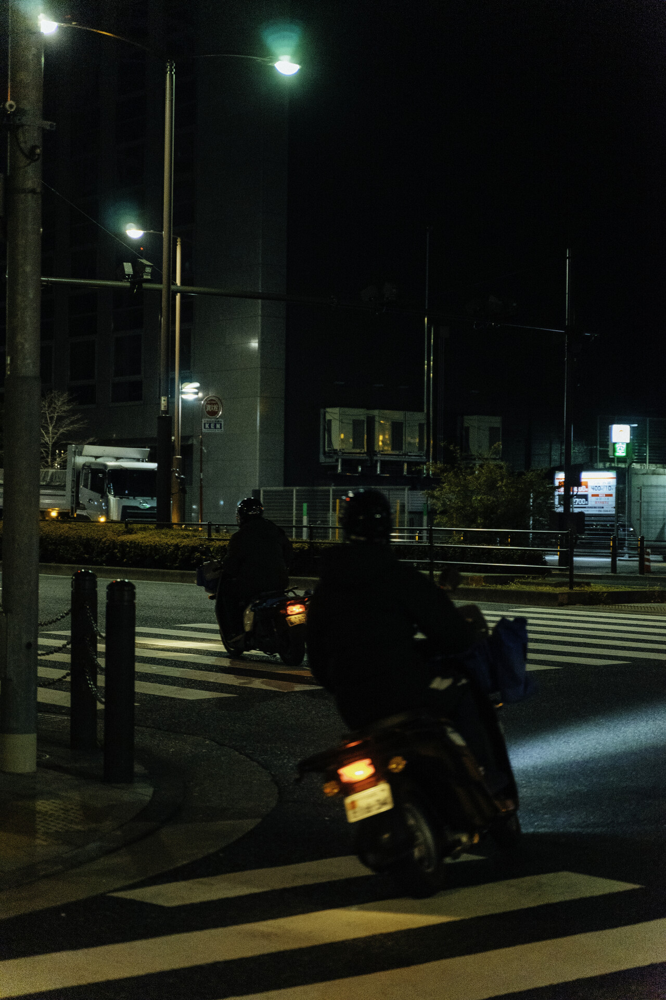
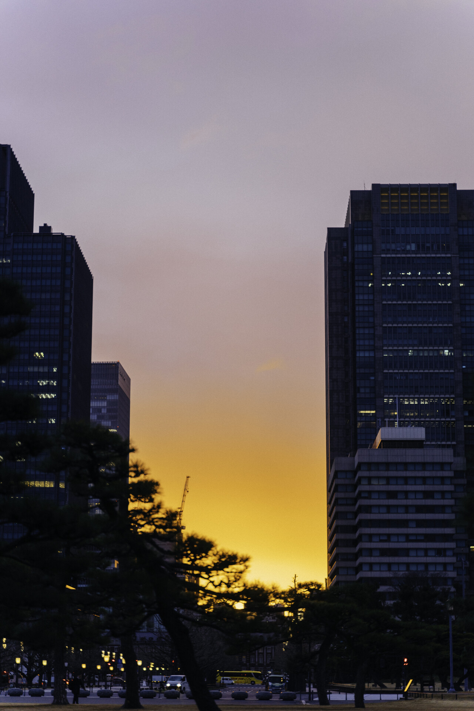
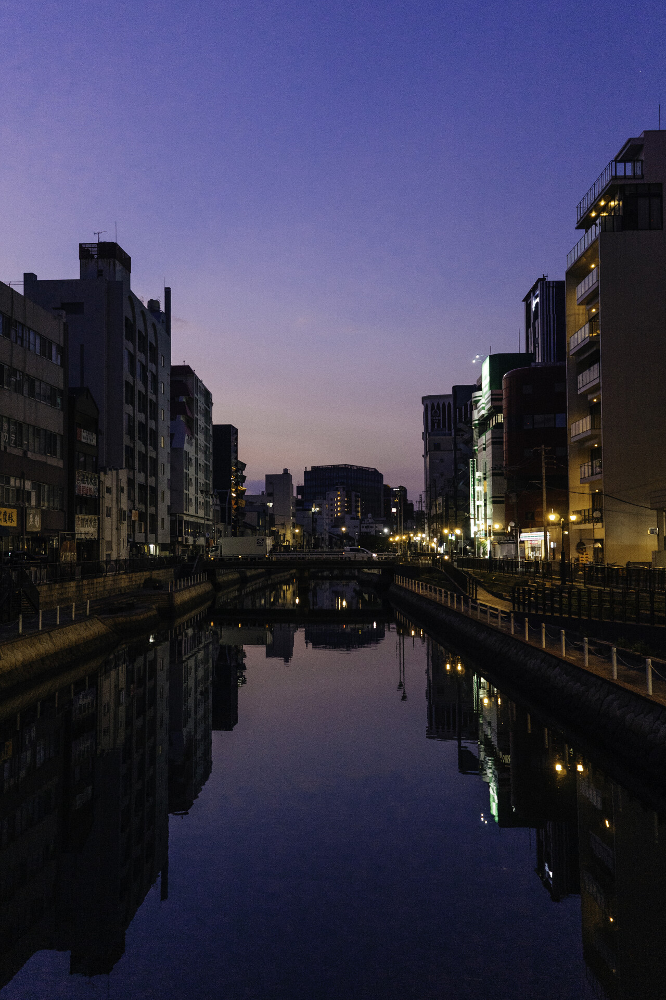
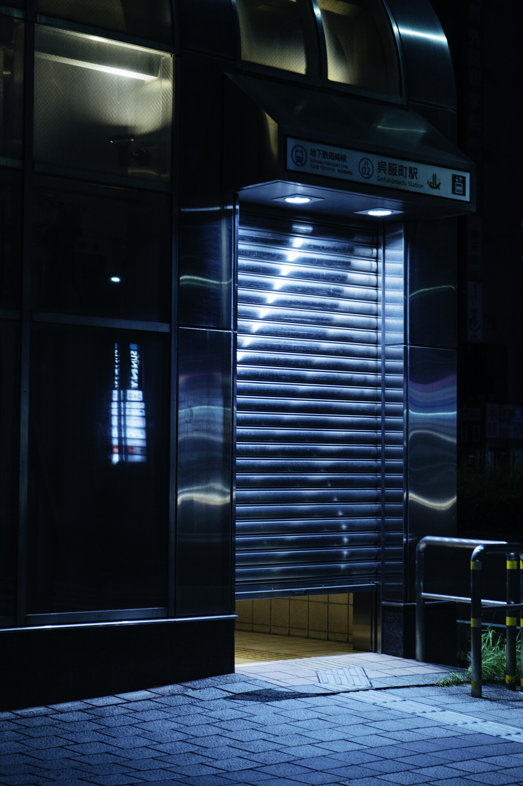
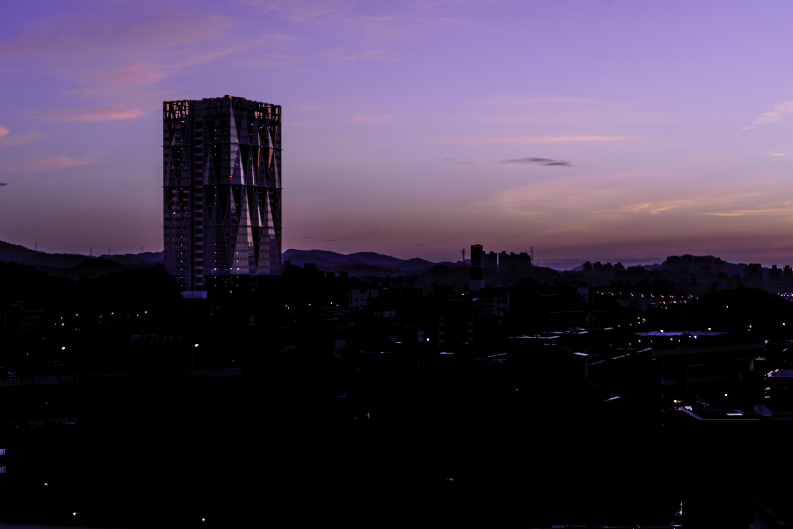

> 這是我的「[BlogBlog 同樂會 - 2026 年 9 月](https://blogblog.club/party/)」的投稿文章。本月主題是「[晚上不睡覺](https://jasonjlai.net/zh/3pwriting/stay-up.html)」，由 [Jason Lai](https://jasonjlai.net/) 主持。如果你有自己的部落格，歡迎一起來參加！

太愛這個月的主題了，畢竟 Jabee 可是常常在該睡覺的時候不睡覺，論半夜要做什麼事情，Jabee 估計可以出一套完整攻略，甚至 Jabee 在 Google Maps 有完整的 "夜晚清單"，主要就是一些夜景點和餐廳。

但 Jabee 今天想分享的不只是 "晚上不睡覺"，其實我更想分享的是 "早上很早起"。同樣都是在夜深人靜的時候在外面，雖然能做的事情可以是大同小異，但其實感受我認為也有很大的不同。

# 晚上不睡覺

## 半夜三件套

Jabee 在上大學後，問我最有印象晚上不睡覺的事情是什麼，我可能會毫不猶豫地說必須是半夜三件套：開車出門、站在路邊抽菸、聊天。自從大家都會開車騎車之後，我們真的很常在寒暑假的晚上把高中同學大家叫出來，然後約一個點，停好車，開始抽菸（當然 Jabee 不抽菸，通常就喝飲料） 然後暢談到深夜！雖然有時候也不知道到底聊了什麼，但是這些同學就是只有半夜才約的出來，每次的談心其實都很愉快，聊的主題每次也都不太一樣。

還記得有一次和同學聊了一整晚基督徒和基督教到底在幹嘛，根本就是假借名義出門，實行傳福音哈哈哈。

當然，這遊戲還會偶爾有變體版。例如說有時候根本就沒約好，就直接開到同學家樓下逼大家出來，接著一個一個車子就坐滿了xdddd。

其實我覺得這個遊戲也挺好的，Jabee 自從上大學之後就沒有再喝過酒了，開車騎車出門就沒有喝酒的可能性，也算是熬夜的健康版了。

## 開車騎車亂逛

這可能在沒有朋友的時候或是需要一個人靜一靜的時候 Jabee 常做的事情。

Jabee 自從高中會開車之後，真的滿常就在12點左右下樓開車。而且不同於平常開車，Jabee 通常會在深夜不開冷氣，把窗戶降下來開，有時候甚至毛毛雨也會把車窗降下來。因為在台北能有新鮮空氣的時間大概就是深夜了，吹著風聽著音樂，那是何等享受啊。聽的音樂也是會也有講究的，滿常都是聽古典樂或是爵士樂，如果想嗨一點的話就會聽越南鼓。不過，在有 Carplay 之前，我大部分都是聽我最愛的電台：FM99.7 台北愛樂電台。

至於騎車的話，滿喜歡深夜的時候上環東跑一圈，騎著車、聽著音樂、吹著風、欣賞夜晚的基隆河可是舒服的！

# 早上很早起

Jabee 有一個很喜歡的 Youtuber，就是鼎鼎大名的 我都ok啊 ，由攝影師-道慈老師開的頻道。頻道過去一直在推廣 "清晨五點散步委員會 "，主要的概念也就一個：在天還是黑的5點，帶著相機出門拍照。我也算是委員會成員之一吧xddd，因為我一直覺得一大早帶著相機出門散步是一件非常舒服的事情，在天空還是黑黑得時候出門完全感受不到任何熱氣，反而是涼涼的空氣迎接著準備出門的你。

也許有些人會問，那這件事也能在晚上不睡覺做啊！

不過概念可完全是不一樣的！"早上很早起" 意味著你是已經睡過一輪覺的，在清醒程度上可是大幅度贏過 "晚上不睡覺"，我認為清醒的出門散步會感受到一股很特別的爽感，甚至我很常散步散一下變得很興奮、很快樂。再者，早上很早起出門，意味著再過1-2小時就能迎接藍調時刻，能在大家都還在睡覺的時候拍到獨一無二的藍調時刻對我來說是很特別的。除此之外呢，我也很常和大家分享為什麼應該超早起：因為每一次的早起都讓我體驗到這個城市屬於我的氛圍，當平常車水馬龍的忠孝東路變成只有我一個人（甚至連應酬喝酒夜店散場的人都已經回家的時候），我感覺我能輕易地掌握這個城市，好似整個城市在我手掌上被我拿捏了！

道慈老師過去也在頻道京都旅行的影片分享他都會很早起去拍照，這是為了避開遊客人潮也能拍出超級觀光客景點的方法。到現在 Jabee 一直銘記在心，幾乎每次旅遊都是早睡早起，幾乎都會在4點起床出門溜搭。

這邊也抓幾張照片和大家分享我清晨都拍到了什麼：

*福岡地下鐵清晨開的瞬間*

*藍調時刻的台北*

